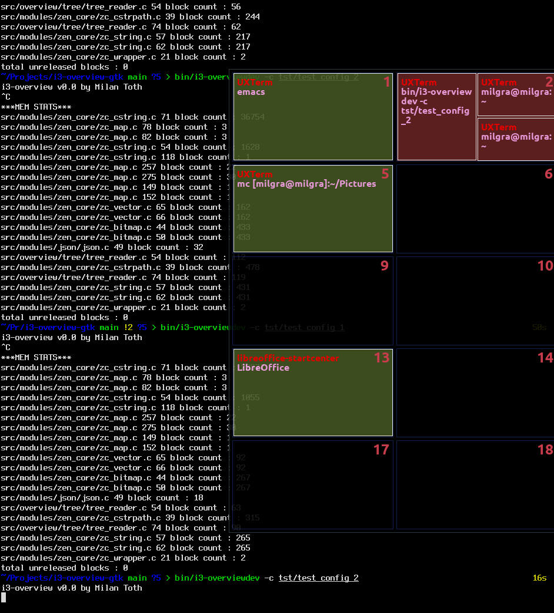

# i3-overview

i3-overview is an application that shows thumbnails for all workspaces to make navigation in i3 easier.




## Features ##

- no downscaled and confusing thumbnails, just crystal clear app names and titles
- layout schema makes workspace identification easier
- super lightweight, 0% cpu and memory usage when idle

## Installation ##

You will need these libraries :

- X11
- Xi
- freetype

Download and build :

```
git clone https://github.com/milgra/i3-overview.git
cd i3-overview
sudo make install
```

You have to set it as floating in i3 config, set it as sticky to keep it on screen during workspace switches, and disable autofocus for it to avoid killing it accidentally.

```
for_window [class="i3-overview"] floating enable
for_window [class="i3-overview"] sticky enable
no_focus [class="i3-overview"]
```

Make it transparent in your compositor, for example, picom
```
opacity-rule = [ 
"90:class_g *?= 'i3-overview'"
];
```

You can start it/test it immediately with :

```
i3-overview
```

Press the meta key (win/mac key) to make i3-overview appear on your screen.

If it doesn't work, check if your meta keycode is 133 with 'xinput test-xi2 --root', the detail field of the event should be 133. If you want a different key to activate i3-overview you have to set it's keycode in i3-overview's config as meta_code, check the Configuration section of this readme.

If it still doesn't work, make sure you have the following command-line utilities ( they are used for font/i3 tree loading ) : 
- fc-list
- i3-msg

If something is still wrong you can check config internals and error messages in verbose mode

```
i3-overview -v
```

To auto-start it after reboot, execute it in i3 config :

```
exec --no-startup-id i3-overview
```

## Uninstall ##

```
cd i3-overview
sudo make remove
```

## Configuration ##

If you want to customize i3-overview, copy /usr/share/i3-overview/config to ~/.config/i3-overview/config and edit it.

Possible keys :

**meta_code** : activator key code, get wanted key code with 'xinput test-xi2 --root', you will need the 'detail' field    
**gap** : distance between workspaces  
**columns** : thumbnail columns  
**ratio** : thumbnail to workspace ratio  
**font_face** : font face, use any string that is output by fc-list  
**text_margin_size** : margin size around text  
**text_margin_top_size** : margin top size over text  
**text_title_size** : title text size  
**text_title_color** : title text color  
**text_description_size** : description text size  
**text_description_color** : description text color  
**text_workspace_size** : workspace number text size  
**text_workspace_color** : workspace number text color  
**text_workspace_xshift** : workspace number x shift  
**text_workspace_yshift** : workspace number y shift  
**border_color** : border color  
**background_color** : background color  
**background_color_focused** : focused background color  

## 5. Contribution/Development ##

Feel free to push fixes/improvements.

Please follow these guidelines :

- use clang format before commiting/after file save
- use zen_core functions and containers and memory handling
- make sure that the app is leak free. if you run the dev build ( make dev ) it automagically checks for leaks on exit on two levels (zc_memory and clang address sanitizer ) and prints leaks
- always run all tests before push ( make test )

## 6. Donate ##

If you use i3-overview daily please consider donating :

[paypal.me/milgra](http://www.paypal.me/milgra)

## 7. Version hsitory ##

1.2 Fullscreen crash fixed
1.1 Multi-Monitor support