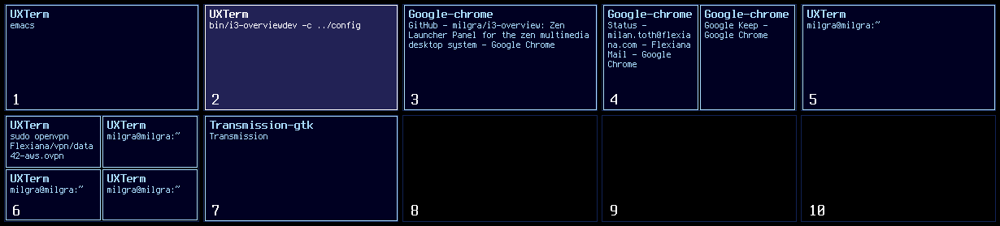

# i3-overview

i3-overview is an application that shows thumbnails of all workspaces to make navigation through i3 workspaces easier.



## Installation ##

Make sure you have the following libraries installed :

- OpenGL
- GLEW
- X11
- Xi
- SDL2
- freetype

Then download and build it :

```
git clone https://github.com/milgra/i3-overview.git
cd i3-overview
sudo make install
```

Then you have to set it as floating in i3 config, set it as sticky to keep it on screen during workspace switches, and disable autofocus for it to avoid killing it accidentally.

```
for_window [class="i3-overview"] floating enable
for_window [class="i3-overview"] sticky enable
no_focus [class="i3-overview"]
```

You can start it/test it immediately with :

```
i3-overview
```

To auto-start it after reboot, execute it in i3 config :

```
exec --no-startup-id i3-overview
```


## Uninstall ##

```
cd i3-overview
sudo make remove
```

## Configuration ##

If you want to customize i3-overview, copy /usr/share/i3-overview/config to ~/.config/i3-overview/config and edit it.

Possible keys :

'key_code' : activator key code, get wanted key code with 'xinput test-xi2 --root' , the 'detail' field    
'gap' : distance between workspaces  
'foreground_color' : color of lines and text  
'background_color_passive' : default background color  
'background_color_active' : active background color  
'font_face' : use any string that is output by fc-list  
'font_size' : size of font  
'font_index' : font index in font file, leave it 0 if you are unsure  